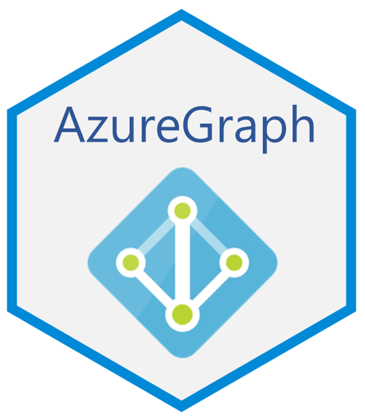

# AzureGraph 

[](https://cran.r-project.org/package=AzureGraph)


A simple interface to the [Microsoft Graph API](https://docs.microsoft.com/en-us/graph/overview). The companion package to [AzureRMR](https://github.com/Azure/AzureRMR) and [AzureAuth](https://github.com/Azure/AzureAuth).

Microsoft Graph is a comprehensive framework for accessing data in various online Microsoft services. Currently, this package aims to provide an R interface only to the Azure Active Directory part, with a view to supporting interoperability of R and Azure: users, groups, registered apps and service principals. Like AzureRMR, it could potentially be extended to cover other services.

The primary repo for this package is at https://github.com/Azure/AzureGraph; please submit issues and PRs there. It is also mirrored at the Cloudyr org at https://github.com/cloudyr/AzureGraph. You can install the development version of the package with `devtools::install_github("Azure/AzureGraph")`.


## Authentication

AzureGraph uses the same authentication procedure as AzureRMR and the [Azure CLI](https://docs.microsoft.com/en-us/cli/azure/?view=azure-cli-latest). The first time you authenticate with a given Azure Active Directory tenant, you call `create_graph_login()` and supply your credentials. R will prompt you for permission to create a special data directory in which to save the obtained authentication token and AD Graph login. Once this information is saved on your machine, it can be retrieved in subsequent R sessions with `get_graph_login()`. Your credentials will be automatically refreshed so you don't have to reauthenticate.

**Linux DSVM note** If you are using a Linux Data Science Virtual Machine in Azure, you may have problems running `create_graph_login()` (ie, without arguments). In this case, try `create_graph_login(auth_type="device_code")`.


## Sample workflow

AzureGraph currently includes methods for working with registered apps, service principals, users and groups. A `call_graph_endpoint()` method is also supplied for making arbitrary REST calls.

```r
library(AzureGraph)

# authenticate with AAD
# - on first login, call create_graph_login()
# - on subsequent logins, call get_graph_login()
gr <- create_graph_login()

# my user information
me <- gr$get_user("me")

# my groups
head(me$list_group_memberships())

# my registered apps
me$list_owned_objects(type="application")

# create an app
# by default, this will have a randomly generated strong password with duration 2 years
app <- gr$create_app("AzureR_newapp")

# get the associated service principal
app$get_service_principal()

# using it in conjunction with AzureRMR RBAC
AzureRMR::get_azure_login()$
    get_subscription("sub_id")$
    get_resource_group("rgname")$
    add_role_assignment(app, "Contributor")
```

---
<p align="center"><a href="https://github.com/Azure/AzureR"></a></p>
